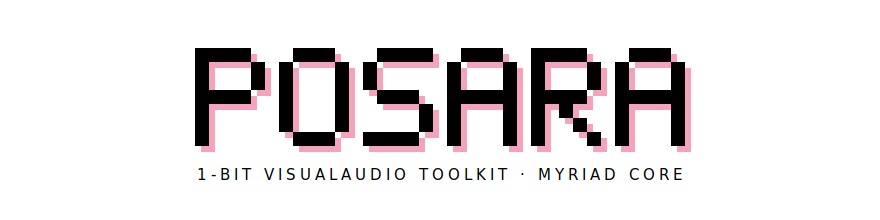
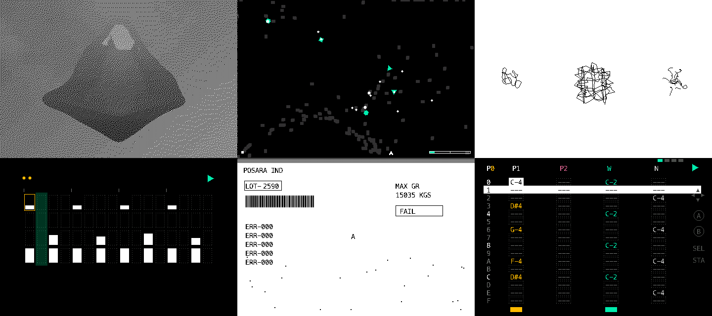

<p align="center"></p>

Your creative visualaudio toolkit for early MacOS aesthetics but modernized.

- **Screen** — minifb
- **Controller** — 8-button bitmap + last ASCII key
- **Audio** — 4 channels (sample + synth + stereo volume)
- **MIDI** — note in / out / wires!

Run on MacOS / Linux / Windows. Bare metals TBA.

<p align="center"></p>

## Build & Run

```sh
cargo build --release
posara run [--root <dir>] [--profile] [--headless] <cart.abe | cart.pk>
```

The interpreter is watched and hot-reloaded.

```sh
# try live coding, start with
posara run carts/music/acid.abe
```

## Why not P5js / L5

Make your own game console and synthesizers (with visuals)!

> Same capability. Better language. Hardware control. Different taste.

## License

MIT
