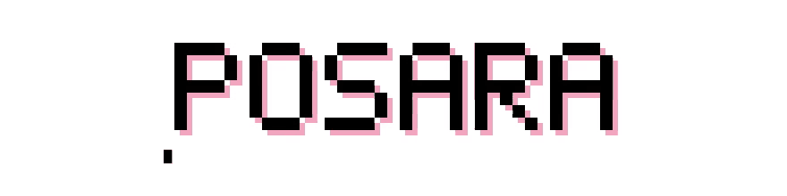
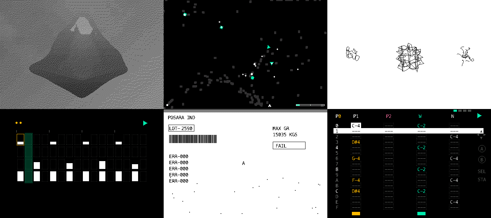

<p align="center"></p>

Your creative visualaudio toolkit for early MacOS aesthetics but modernized.

- **Screen** — windowed or in browser
- **Controller** — 8-button bitmap + last ASCII key
- **Audio** — sample + synth + stereo volume
- **MIDI** — note in / out / wires!

Run on MacOS / Linux / Windows. Play in [WEB NOW](https://khn190.github.io/posara/). Bare metals TBA. 

> Listen to the [album](https://soundcloud.com/rusty-ocean-blue/sets/posara-vol-1) made by Posara.

<p align="center"></p>

## Build & Run

```sh
cargo build --release
posara run [--root <dir>] [--profile] [--headless] <cart.abe | cart.pk>
```

The interpreter is watched and hot-reloaded.

```sh
# try live coding, start with
posara run carts/vis/acid.abe
```

## Why Not All Others

At some time I felt them insufficient or too restricted. Now with Posara you can make your own game console and synthesizers with visuals. It is lean designed on the first day.

> Same capability, better language. Hardware control, different taste.

## License

MIT
